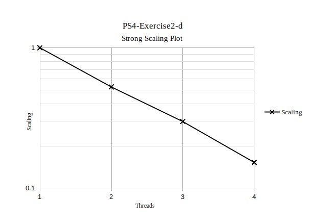

# Exercise 2  
######  Programming SS 2019 - Problem Set 4
Author: *Elena Pfefferlé*, *Pascal Schenk*, *Àlvaro Morales*

#### Exercise 2A:

- Measured runtime for 10'000 sample points   : **0.00600764 sec**
- Measured runtime for 100'000 sample pointes : **0.052242 sec**

**Note**: Execution outputs are stored in *2a/output/*.

#### Exercise 2B-C:

- Measured runtime for n=10'000 and m=100'000   : **0.190815 sec**

**Note**: Exection output is stored in *2b-c/output/*

#### Exercise 2D:

We are asked to generate a *strong-scalling* plot based on the timings recorded when executing the code with 1,2,4,8 CPUs (threads in our case).

Strong scaling (*T*) is calculated as follow:

Where:
- *t1* : time to complete work with one processing element.
- *tn* : time to complete work with *n* processing elements
- *N* : amount of processing elements

#### Bonus Question:

Why should we generate the random numbers before the parallel region ?

- If we don't, each thread will generate its normally-distributed random numbers, but in our case, we need each thread to use the same set of normally-distributed random numbers otherwise the final result will change with the amount of threads used.
