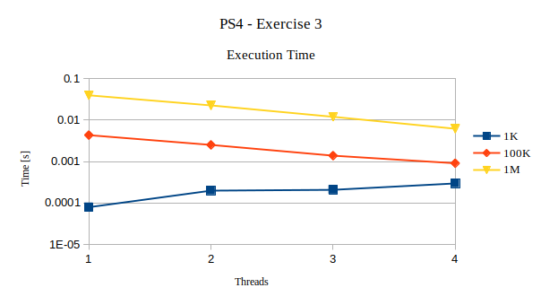

# Exercise 3  
######  Programming SS 2019 - Problem Set 4
Author: *Elena Pfefferlé*, *Pascal Schenk*, *Àlvaro Morales*

#### Exercise 3B-C:

We are asked to experiment with the number of random numbers created and to run the code with varying number of threads (1,2,4,8).

Here is how the execution time varies:

**Note**: Execution outputs are stored in *Exercise3/output/*.
