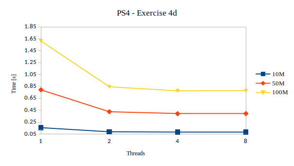

# Exercise 4  
######  Programming SS 2019 - Problem Set 4
Author: *Elena Pfefferlé*, *Pascal Schenk*, *Àlvaro Morales*

#### Exercise 4D:

We are asked to play with different vector size and observe the running times of the program.

Here is how the execution time varies between 1 to 4 threads :

**Note**: Execution time will vary depending of the machine executing the code.

#### Exercise 4E-G

Here we need to submit the program to *AlphaCruncher* using 1 to 8 threads with
different array length (between 10'000 to 500'000'000). We decided to go with 10'000, 100'000'000 and 500'000'000.

For each array length we submitted the program with 1 to 8 threads. The execution time is scaled down as threads increase:

#### Exercise 4H

How is the scaling affected ?
- As we add threads, the impact on the runtime is reduced. As example the most notable time reduction occurs between 1 & 2 threads.
- Some parts of our code are not ran in parallel (declarations/initialization and console output), no matter how many threads run this code, the serial parts execution will not be reduced.

The below shows the running time for different array sizes in a linear fashion, the depict better the reduction of speedup as we add more threads to run the program :

