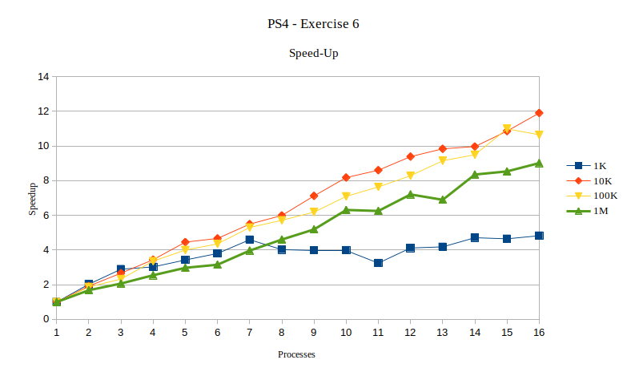
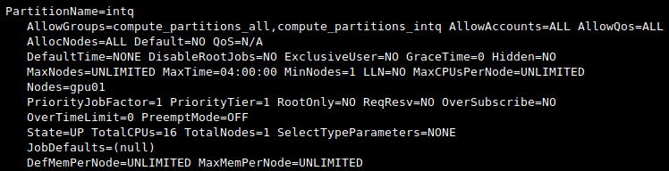
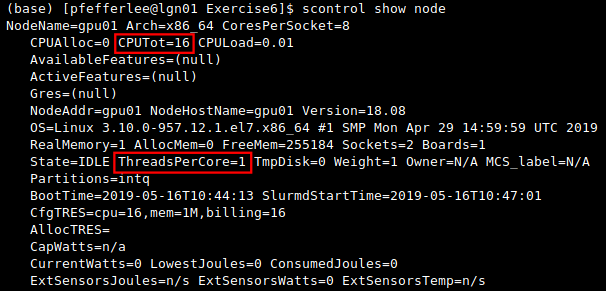

# Exercise 6  
######  Programming SS 2019 - Problem Set 4
Author: *Elena Pfefferlé*, *Pascal Schenk*, *Àlvaro Morales*

We are asked to check the speed-up for combinations of MPI processes and sample points using one node on *Alphacruncher*.

Speed-up in latency is calculated as follow:

In our case, *told* is the runtime with **one** thread.

**Note1** : The exercise asks to try combination of MPI processes between 1 & 20. However, we noticed that jobs submitted with more that 16 threads would not start;
- The job status *PD* (pending) would not change, the reason being *Ressources*.

We noticed that the session used (`intq`), features only 16 CPUs, it means that only 16 tasks can be ran in parallel.

Additionally, looking at the `node` parameters, we could see that not only the session features only 16 CPUs, but each core is limited to **one** thread only.

With two sockets, 8 cores per sockets and 1 thread per core, we are only allowed to run 16 tasks (`ntasks`) in parallel.

**Note2**: Execution outputs are stored in *Exercise6/output/*.
